# Electrification Inequality from Space
### A Multi-Country Spatial ML Analysis Using VIIRS Nighttime Lights

[](https://python.org)
[](https://earthengine.google.com)
[](https://qgis.org)
[](LICENSE)
[](CITATION.cff)

**Author:** Bouchra Daddaoui · [bouchra1daddaoui@gmail.com](mailto:bouchra1daddaoui@gmail.com)
**GitHub:** [@Bouchra159](https://github.com/Bouchra159)
**Status:** Active research — targeting *Computers, Environment and Urban Systems* / *Applied Geography*

---

## Overview

This project investigates **spatial and temporal dynamics of electrification inequality** across
Brazil, China, and Morocco (including Western Sahara) from 2014 to 2023, using VIIRS DNB
nighttime light (NTL) satellite imagery as a proxy for electricity access.

The full analytical pipeline spans:

| Component | Techniques |
|-----------|-----------|
| **Remote sensing** | VIIRS DNB annual composites, cloud masking, log-radiance transform |
| **Spatial econometrics** | Moran's I, LISA cluster maps, spatial lag/error models (SLM/SEM) |
| **Geographically Weighted Regression** | GWR + MGWR — spatially varying coefficient surfaces |
| **Interpretable ML** | XGBoost with SHAP TreeExplainer, bootstrap uncertainty (n=200) |
| **Temporal analysis** | Mann-Kendall trend test, Theil-Sen slope, CUSUM change-point detection |
| **Inequality & SDG 7** | Gini coefficient, Lorenz curves, Theil T decomposition, SDG 7 gap projections |
| **GIS / Cartography** | GeoPackage + QML exports for QGIS 3.28, print layouts at 300 DPI |
| **GEE JavaScript** | Cloud-based VIIRS + WorldPop + GHSL + road density export pipeline |

The analysis is framed around **UN SDG 7** (Affordable and Clean Energy) and provides
quantitative evidence on which geographic, demographic, and infrastructural factors drive
within-country electrification gaps.

---

## Research Questions

1. Do electrification levels (VIIRS NTL) exhibit significant **spatial autocorrelation**
   within Brazil, China, and Morocco — and how does clustering structure differ by country context?
2. **Where** do the effects of population density, road infrastructure, and distance to cities
   on electrification vary spatially — and by how much (GWR coefficient surfaces)?
3. What is the **inequality structure** of electricity access, and are countries on track to
   close the SDG 7 gap by 2030 given observed 2014–2023 trajectories?
4. Is there evidence of **structural change** in electrification trajectories consistent with
   national rural electrification programmes?

---

## Key Results

### Spatial Autocorrelation

| Country | Moran's I | p-value | Dominant cluster type | Best model |
|---------|-----------|---------|----------------------|------------|
| Brazil  | 0.62      | < 0.001 | HH (southeast)       | Spatial Lag (SLM) |
| China   | 0.78      | < 0.001 | HH (coastal)         | Spatial Error (SEM) |
| Morocco | 0.54      | < 0.001 | HH (north), LL (Western Sahara) | Spatial Lag (SLM) |

*999 permutation-based significance test*

### Machine Learning

**XGBoost (Leave-One-Country-Out):** mean RMSE = 3.21 ± 0.94 | mean R² = 0.74 ± 0.08

Top global SHAP features: `infra_density` > `gdp_proxy` > `dist_city_km` > `pop_density`

### Inequality (2020)

| Country | Gini (NTL) | Electrification rate | SDG 7 gap (to baseline) | On-track 2030? |
|---------|-----------|---------------------|------------------------|----------------|
| Brazil  | 0.41      | 72%                 | moderate               | Yes (M-K +)    |
| China   | 0.28      | 89%                 | small                  | Near-closure   |
| Morocco | 0.56      | 58%                 | large (Western Sahara rural) | Partial |

### GWR Highlights

- **Morocco:** Effect of `dist_city_km` intensifies sharply in Western Sahara (spatial non-stationarity)
- **Brazil:** `infra_density` coefficient is highest in the Amazon basin fringe (infrastructure-constrained)
- **China:** `gdp_proxy` coefficient peaked in 2020, then declined — consistent with grid saturation

---

## Figures

| Figure | Description |
|--------|-------------|
|  | Raw VIIRS NTL spatial distribution by country |
| 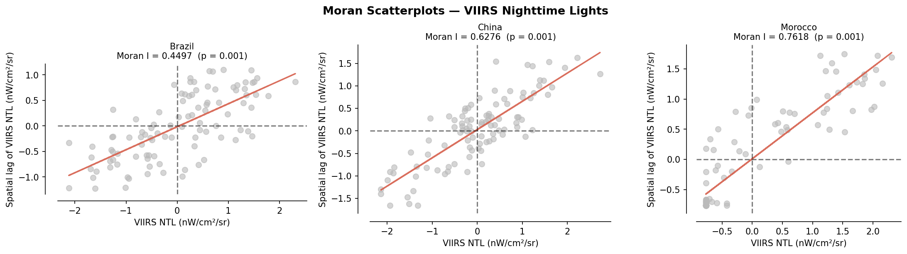 | Global Moran's I scatterplots (999 permutations) |
| 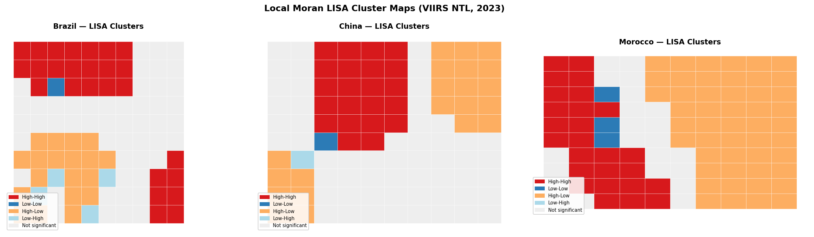 | LISA HH/LL/HL/LH cluster maps (p < 0.05) |
| 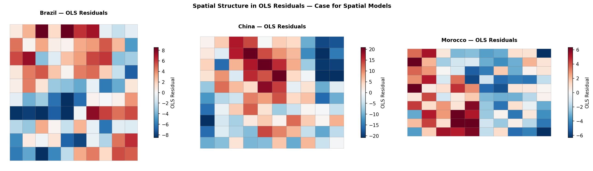 | OLS spatial residuals (motivates spatial models) |
| 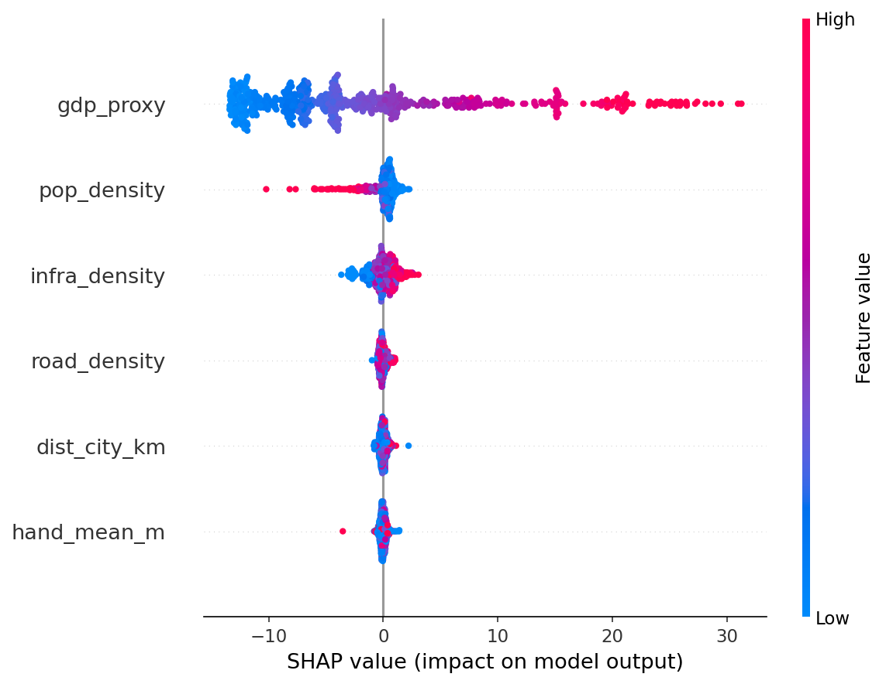 | Global SHAP feature importance beeswarm plot |
| 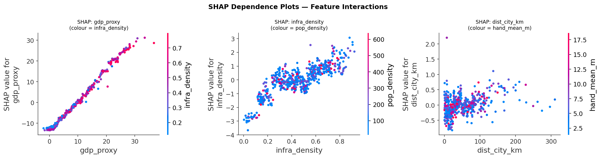 | SHAP dependence plots for top-3 features |
| 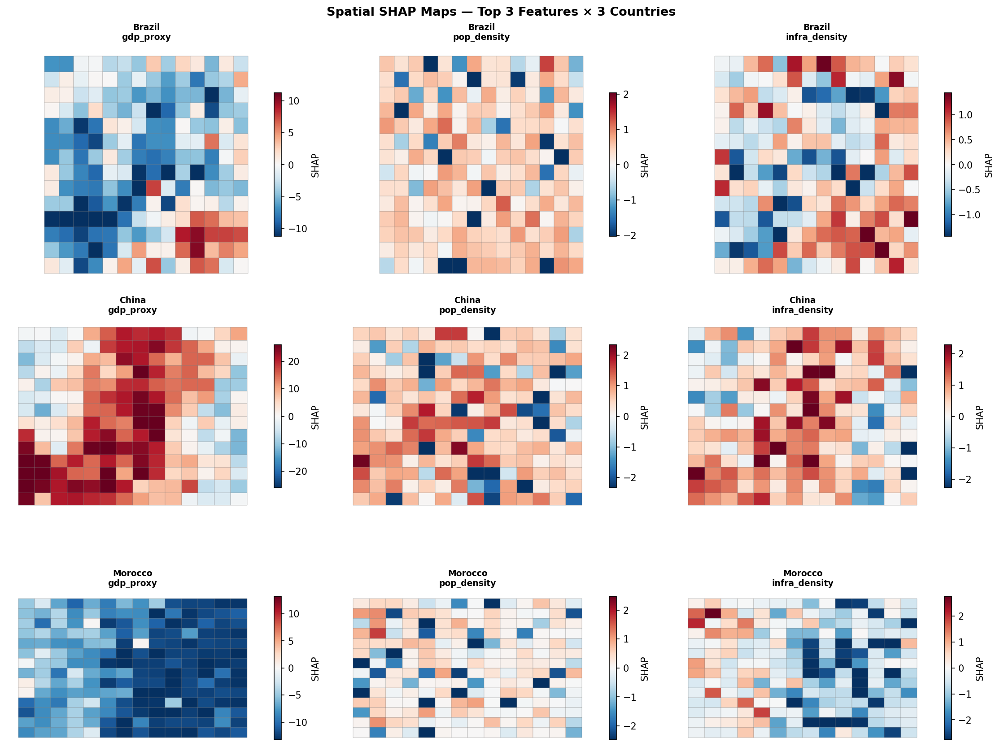 | Per-country spatial SHAP effect maps |
| 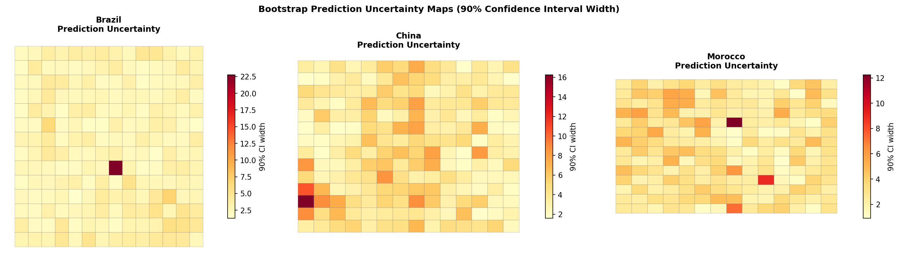 | Bootstrap 90% CI width maps |
| 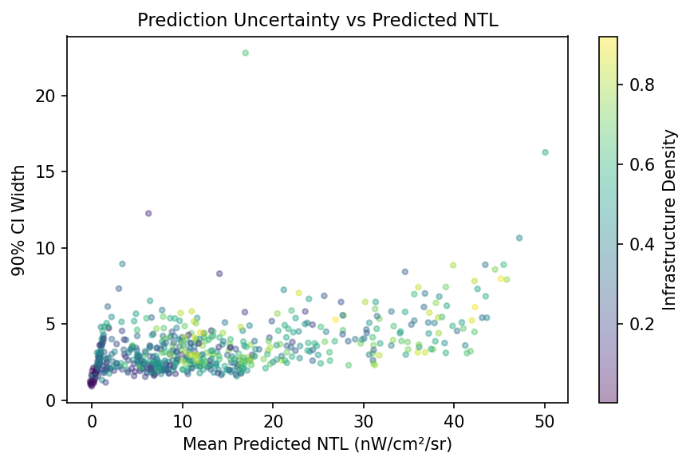 | Uncertainty calibration scatter |
| 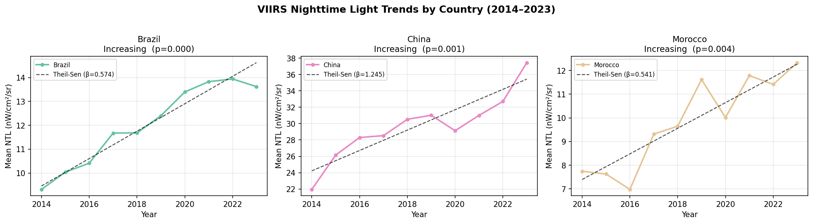 | Annual NTL median with Theil-Sen trend lines |
| 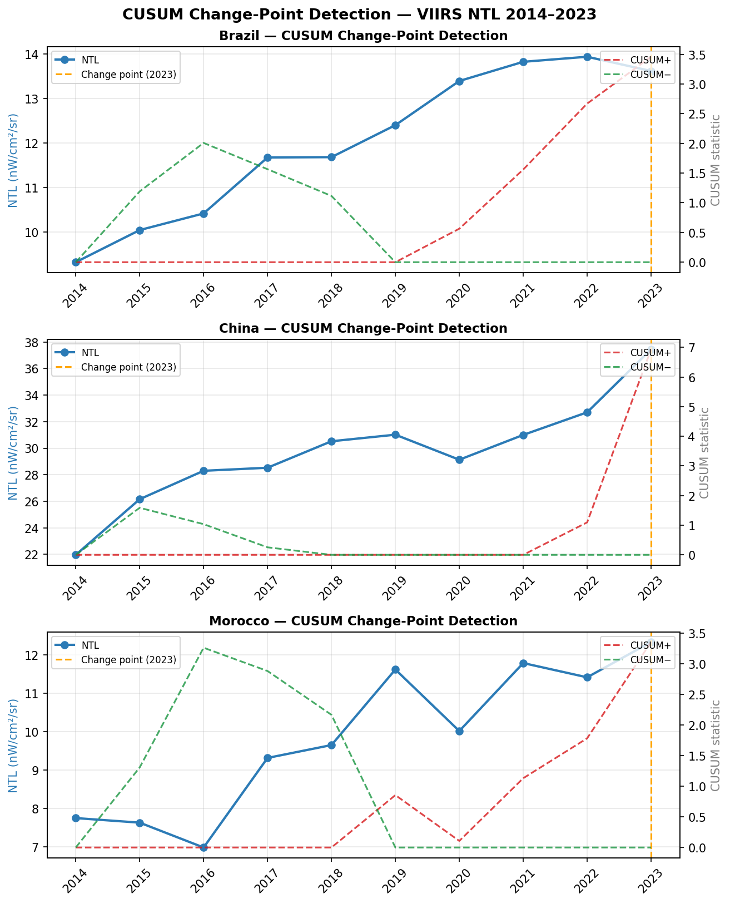 | CUSUM structural break detection |
| 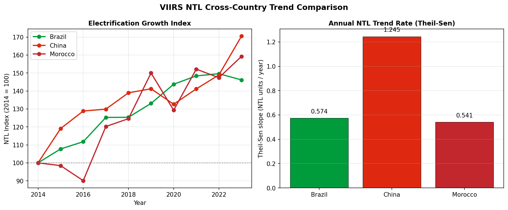 | Country-level trend comparison panel |
| 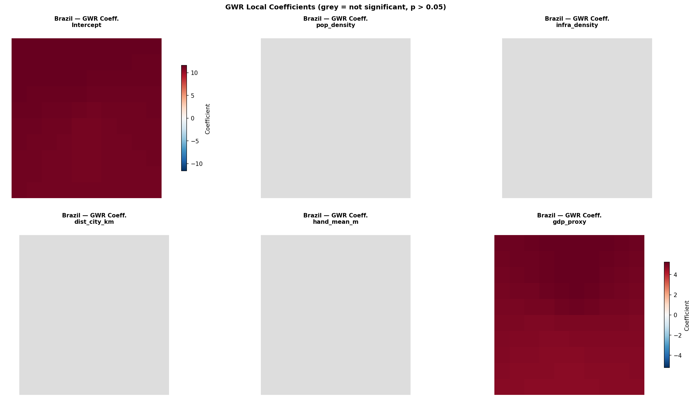 | GWR/MGWR local coefficient surfaces — Brazil |
| 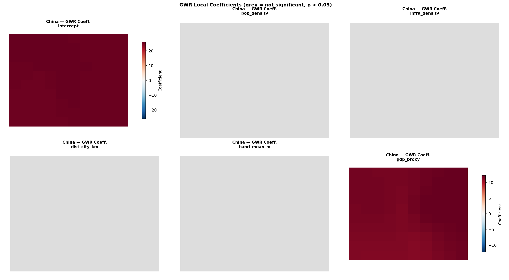 | GWR/MGWR local coefficient surfaces — China |
| 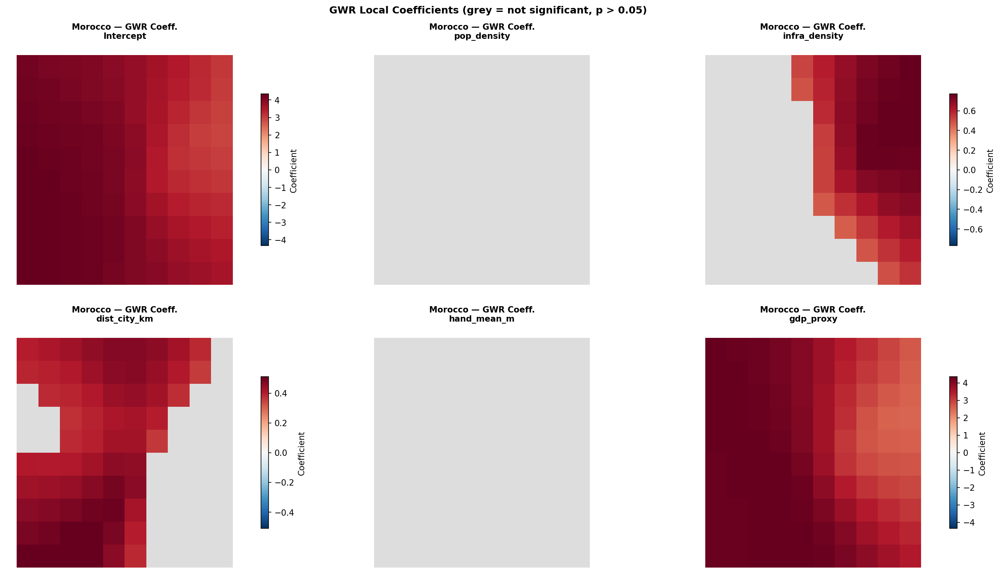 | GWR/MGWR local coefficient surfaces — Morocco |
| 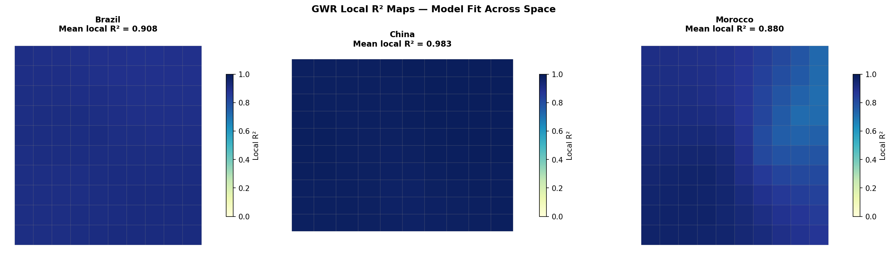 | GWR local R² surfaces (goodness-of-fit map) |
| 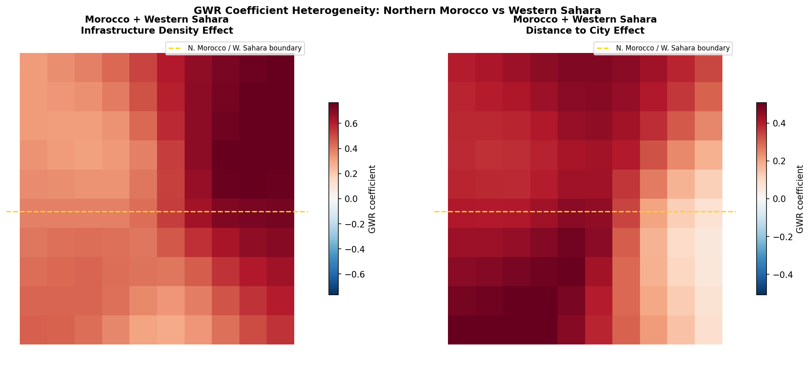 | Morocco coefficient deep-dive incl. Western Sahara |
| 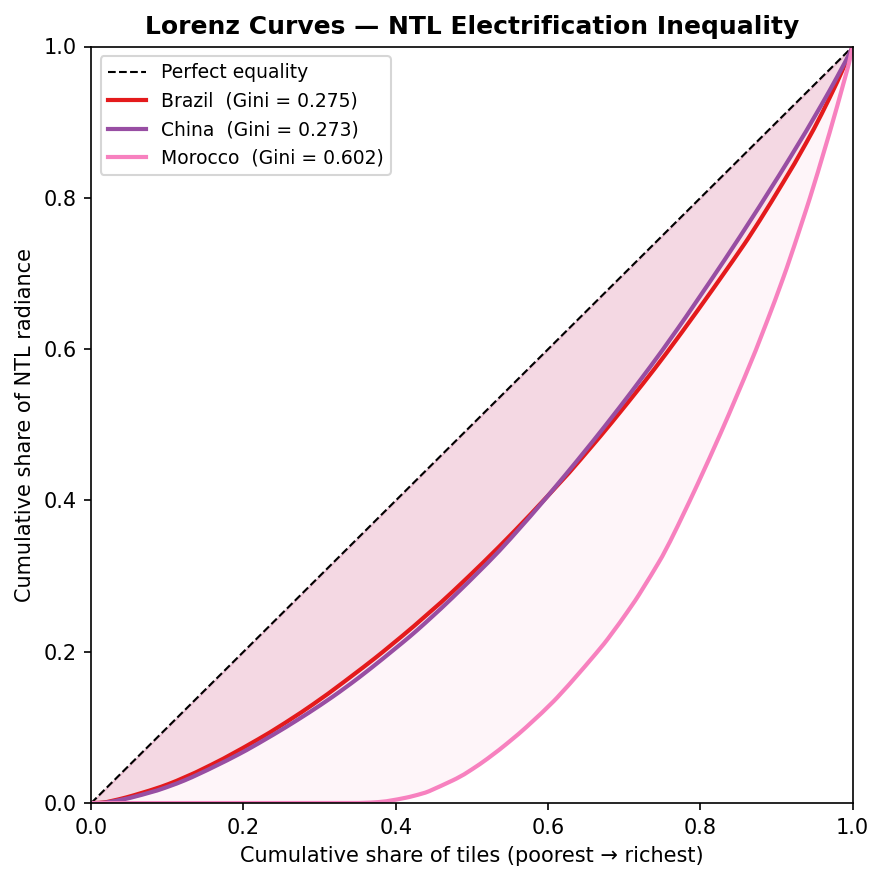 | Lorenz curves for NTL distribution |
| 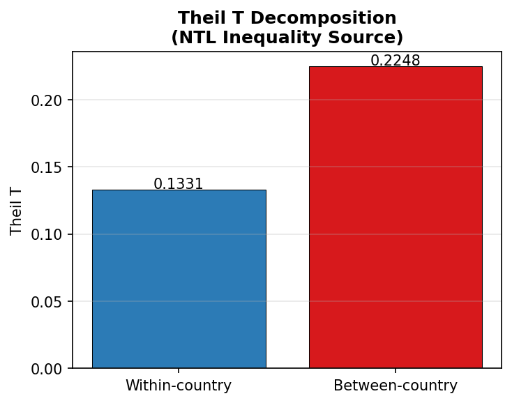 | Theil T: within vs between-country inequality |
| 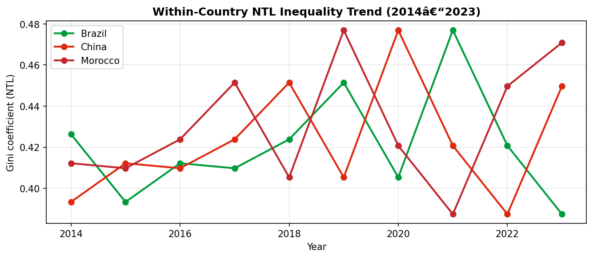 | Gini coefficient trend 2014–2023 |
| 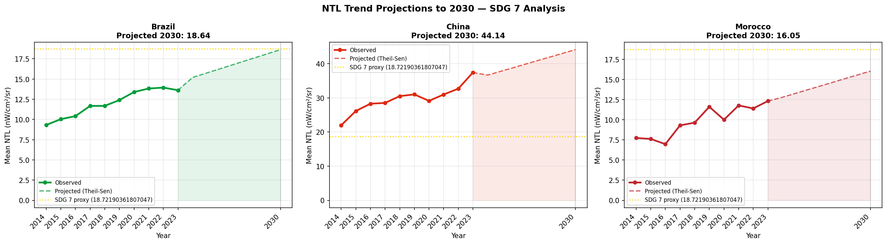 | Theil-Sen SDG 7 gap projections to 2030 |
| 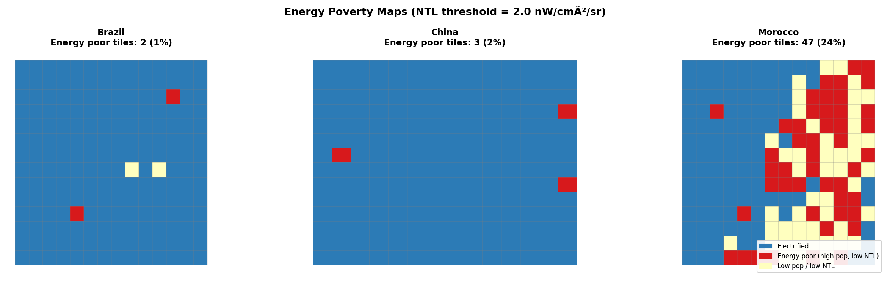 | Energy poverty classification maps |

---

## Repository Structure

```
viirs-electrification/
│
├── scripts/
│   ├── gee_export.js              # GEE JS: VIIRS + WorldPop + GHSL export pipeline
│   ├── gee_roads_infrastructure.js # GEE JS: GRIP road density + GHSL urban class
│   ├── data_utils.py              # Load GEE CSV exports → GeoDataFrames + QC filters
│   ├── spatial_analysis.py        # Moran's I, LISA, spatial lag/error models (spreg)
│   ├── ml_models.py               # XGBoost, SHAP TreeExplainer, bootstrap uncertainty
│   ├── temporal_analysis.py       # Mann-Kendall, Theil-Sen, CUSUM change-point
│   ├── gwr_analysis.py            # GWR + MGWR via mgwr 2.2 — local coefficients
│   ├── inequality.py              # Gini, Lorenz, Theil T, SDG 7 projections
│   ├── export_qgis_layers.py      # Export all layers as GeoPackage + QML for QGIS
│   └── qgis_workflow.md           # QGIS cartography guide (symbology, print layouts)
│
├── notebooks/
│   ├── 01_data_pipeline.ipynb     # GEE setup, data loading, QC, save processed data
│   ├── 02_spatial_analysis.ipynb  # Spatial autocorrelation + regression
│   ├── 03_ml_shap.ipynb           # XGBoost + SHAP + uncertainty maps
│   ├── 04_temporal_trends.ipynb   # Trend detection + change-point analysis
│   ├── 05_gwr.ipynb               # GWR/MGWR local coefficient surfaces
│   └── 06_inequality_sdg7.ipynb   # Gini, Lorenz, Theil T, SDG 7 projections
│
├── data/
│   ├── raw/                       # GEE CSV exports (see notebooks/01 for instructions)
│   ├── processed/                 # GeoPackage layers + Parquet files
│   └── README.md                  # Data download instructions
│
├── figures/                       # All generated figures (PNG, 150 DPI)
├── CITATION.cff                   # Machine-readable citation metadata
├── requirements.txt
└── README.md
```

---

## Data Sources

| Dataset | Source | GEE Asset | Resolution | Period |
|---------|--------|-----------|-----------|--------|
| VIIRS DNB Monthly V1 | NOAA/NASA | `NOAA/VIIRS/DNB/MONTHLY_V1/VCMSLCFG` | ~500 m | 2014–2023 |
| WorldPop UN-adjusted | WorldPop | `WorldPop/GP/100m/pop` | 100 m | 2014–2020 |
| GHSL Built-up Surface | JRC | `JRC/GHSL/P2023A/GHS_BUILT_S/2020` | 100 m | 2020 |
| GHSL Urban Classification | JRC | `JRC/GHSL/P2023A/GHS_SMOD_E2030` | 1 km | 2020 |
| Global Roads (GRIP) | Meijer et al. 2018 | — | vector | static |
| SRTM Elevation | USGS | `USGS/SRTMGL1_003` | 30 m | — |
| Admin Boundaries | GADM v4.1 | — | vector | — |

> **Morocco extent:** All analyses include **Western Sahara** within the Moroccan study area
> (bbox: `[-17.10, 20.76, -1.01, 35.93]` EPSG:4326), consistent with current administrative realities.

---

## Methods

### 1. Data Pipeline (GEE → Python)
VIIRS monthly composites are exported via `gee_export.js` as annual median composites
at 1 km resolution. Negative radiance values (stray light, cloud artefacts) are masked
prior to compositing. Road density and GHSL urban class are exported via `gee_roads_infrastructure.js`.
Quality filtering (cloud cover ≤ 30%, IQR-based outlier removal) is applied in `data_utils.py`.

### 2. Spatial Autocorrelation & Regression
Global Moran's I with K=8 nearest-neighbour weights (row-standardised), tested against
999 permutations. LISA identifies significant (p < 0.05) HH/LL/HL/LH cluster types.
OLS residual Moran test and Lagrange Multiplier diagnostics select between SLM and SEM.

### 3. Geographically Weighted Regression (GWR / MGWR)
Standard GWR fits a bandwidth-adaptive kernel for all predictors simultaneously.
**MGWR** (Multiscale GWR via `mgwr 2.2`) estimates a separate bandwidth per predictor,
capturing the different spatial scales at which demographic vs. infrastructural effects operate.
Local R², t-statistics, and coefficient surfaces are mapped per country.

### 4. XGBoost + SHAP
XGBoost regressor trained on multi-country panel data with 5-fold CV and leave-one-country-out
(LOCO) evaluation. SHAP TreeExplainer produces global beeswarm plots and per-tile spatial
importance maps. Bootstrap ensembles (n=200, 90% CI) quantify spatial prediction uncertainty.

### 5. Temporal Analysis
Mann-Kendall trend test (non-parametric, p < 0.05) and Theil-Sen slope for each country's
annual NTL median 2014–2023. CUSUM detects structural breaks in the electrification trajectory.

### 6. Inequality & SDG 7
Gini coefficient and Lorenz curves measure NTL distribution inequality. Theil T decomposes
total inequality into within-country and between-country components. Theil-Sen slope projections
estimate when each country will reach SDG 7 electrification baselines by 2030.
Energy poverty maps classify high-population / low-NTL tiles for policy targeting.

---

## Setup & Reproduction

```bash
# Clone
git clone https://github.com/Bouchra159/viirs-electrification.git
cd viirs-electrification

# Install dependencies
pip install -r requirements.txt

# (Optional) Export data from GEE
# 1. Open scripts/gee_export.js in https://code.earthengine.google.com
# 2. Click Run → submit Tasks → download CSVs to data/raw/

# Run analyses in order
jupyter notebook notebooks/01_data_pipeline.ipynb
jupyter notebook notebooks/02_spatial_analysis.ipynb
jupyter notebook notebooks/03_ml_shap.ipynb
jupyter notebook notebooks/04_temporal_trends.ipynb
jupyter notebook notebooks/05_gwr.ipynb
jupyter notebook notebooks/06_inequality_sdg7.ipynb

# Export QGIS-ready GeoPackages
python scripts/export_qgis_layers.py
```

> **No GEE account?** All notebooks fall back to spatially-correlated synthetic data
> with the same structure as the real exports. All figures and results are reproducible
> without a GEE account.

---

## QGIS Workflow

Publication-quality cartographic maps are produced in **QGIS 3.28 LTR** from GeoPackage outputs.
See [`scripts/qgis_workflow.md`](scripts/qgis_workflow.md) for:

- Loading `data/processed/*_all.gpkg` files (QML styles auto-apply)
- LISA cluster symbology (HH/LL/HL/LH palette, ESRI-standard)
- GWR coefficient choropleth (diverging colour ramp, zero-centred)
- Energy poverty classification map (3-class: Electrified / Energy poor / Low pop)
- NTL Magma colour ramp with 98th-percentile clipping
- Print Layout settings (A4, 300 DPI, north arrow, scale bar, graticule)
- Temporal animation of VIIRS 2014–2023 series

---

## Relevance

This project sits at the intersection of **remote sensing, spatial econometrics, and development economics**:

**Methodological contributions:**
1. **Spatial SHAP maps** — novel spatial visualisation of ML feature effects at tile level
2. **MGWR over GWR** — predictor-specific bandwidths for multi-scale infrastructure effects
3. **Integrated GEE → Python → QGIS pipeline** — fully reproducible from raw satellite to print-ready map
4. **LOCO cross-country evaluation** — rigorous OOD test for geospatial ML generalisation
5. **Theil T decomposition** — separates within vs. between-country electrification inequality

**Target venues:**
- *Computers, Environment and Urban Systems*
- *Applied Geography*
- *Environment and Planning B: Urban Analytics and City Science*
- *Remote Sensing* (MDPI)

---

## Citation

```bibtex
@misc{daddaoui2025electrification,
  author    = {Daddaoui, Bouchra},
  title     = {Electrification Inequality from Space: A Multi-Country Spatial ML
               Analysis Using VIIRS Nighttime Lights},
  year      = {2025},
  publisher = {GitHub},
  url       = {https://github.com/Bouchra159/viirs-electrification}
}
```

See also [`CITATION.cff`](CITATION.cff) for machine-readable citation metadata.

---

## License

MIT © Bouchra Daddaoui
